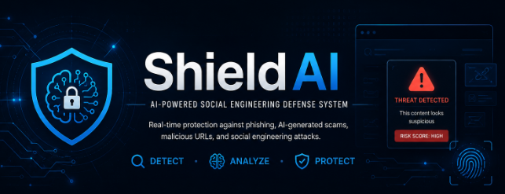
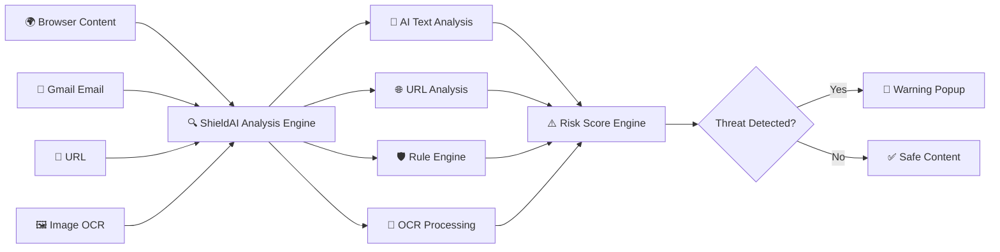

<p align="center">
  
</p>
<p align="center">


</p>
# 🛡️ ShieldAI

### AI-Powered Social Engineering Defense System

## 📖 Overview

Modern phishing attacks are no longer limited to suspicious links or poorly written emails. Attackers now use Generative AI to create highly convincing messages, fake login pages, and image-based scams that closely resemble legitimate communication.

**ShieldAI** is an AI-powered browser extension designed to defend users against these evolving threats. It combines machine learning, OCR, URL intelligence, and rule-based threat detection to analyze suspicious content in real time and provide an immediate risk assessment before users interact with potentially malicious websites, emails, or messages.

Unlike traditional phishing detection tools that rely mainly on blacklists or keyword matching, ShieldAI performs multi-layer analysis by combining:

- 🧠 AI-based text classification
- 🌐 URL reputation and pattern analysis
- 🖼️ OCR for image-based scam detection
- 📧 Gmail email scanning
- ⚠️ Risk score generation
- 🛡️ Rule-based cybersecurity checks

This hybrid approach enables the extension to detect modern social engineering attacks more accurately while remaining lightweight, privacy-conscious, and compatible with Chromium-based browsers.
---

## Key Features

- AI-powered scam message detection
- Suspicious URL analysis
- OCR-based image scanning
- Gmail protection
- Real-time webpage monitoring
- Risk score generation
- Warning popups
- Cross-browser support (Chromium-based browsers)

---

## Tech Stack

- JavaScript
- HTML & CSS
- Vite
- Chrome Extension API
- ONNX Runtime
- OCR
- Tailwind CSS
- Playwright

---

## Workflow- Detection Pipeline


---

## Project Structure

```text
src/
│
├── analyzers/
├── background/
├── content/
├── gmail-addon/
├── ml/
├── popup/
├── options/
└── shared/

public/
│
├── datasets/
├── models/
├── rules/
└── icons/
```

---

## License

MIT License
