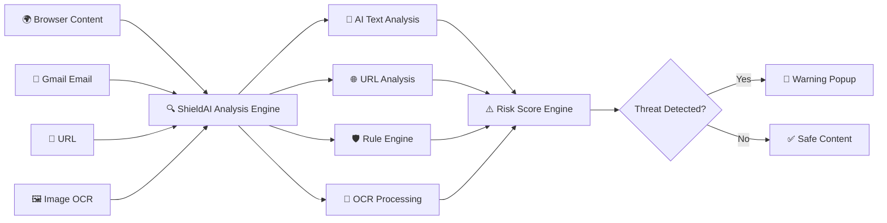
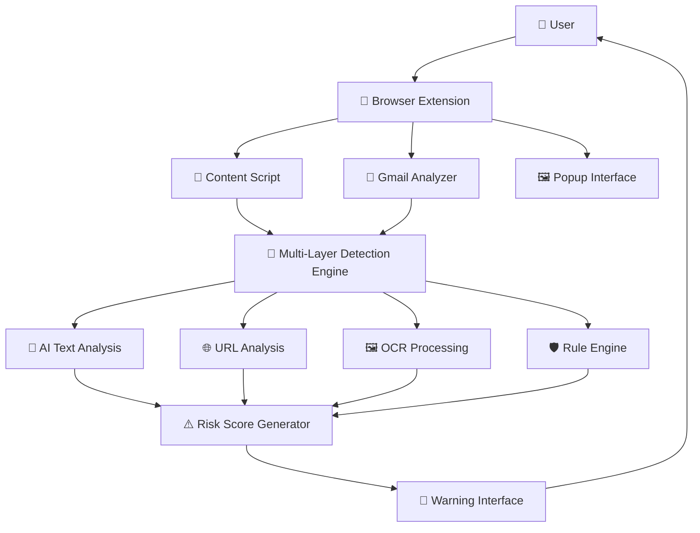

<p align="center">
  
</p>
<p align="center">


</p>
# 🛡️ ShieldAI

### AI-Powered Social Engineering Defense System

## 📖 Overview

Modern phishing attacks are no longer limited to suspicious links or poorly written emails. Attackers now use Generative AI to create highly convincing messages, fake login pages, and image-based scams that closely resemble legitimate communication.

**ShieldAI** is an AI-powered browser extension designed to defend users against these evolving threats. It combines machine learning, OCR, URL intelligence, and rule-based threat detection to analyze suspicious content in real time and provide an immediate risk assessment before users interact with potentially malicious websites, emails, or messages.

Unlike traditional phishing detection tools that rely mainly on blacklists or keyword matching, ShieldAI performs multi-layer analysis by combining:

- 🧠 AI-based text classification
- 🌐 URL reputation and pattern analysis
- 🖼️ OCR for image-based scam detection
- 📧 Gmail email scanning
- ⚠️ Risk score generation
- 🛡️ Rule-based cybersecurity checks

This hybrid approach enables the extension to detect modern social engineering attacks more accurately while remaining lightweight, privacy-conscious, and compatible with Chromium-based browsers.
---

## Key Features

- AI-powered scam message detection
- Suspicious URL analysis
- OCR-based image scanning
- Gmail protection
- Real-time webpage monitoring
- Risk score generation
- Warning popups
- Cross-browser support (Chromium-based browsers)

---

## Tech Stack

- JavaScript
- HTML & CSS
- Vite
- Chrome Extension API
- ONNX Runtime
- OCR
- Tailwind CSS
- Playwright

---

## Workflow- Detection Pipeline


---

### Detection Flow

The detection pipeline follows a multi-layer analysis approach to improve the accuracy of identifying phishing and social engineering attacks.

1. The browser extension continuously monitors webpages, emails, URLs, and image-based content.

2. All collected inputs are passed to the Multi-Layer Detection Engine.

3. The engine performs parallel analysis using:
   - AI-based text classification
   - URL reputation analysis
   - OCR-based image processing
   - Rule-based threat detection

4. The outputs from all detection modules are combined to generate a final risk score.

5. Based on the calculated score, ShieldAI either displays a security warning or marks the content as safe.

## System Architecture


### Architecture Overview

ShieldAI follows a modular architecture in which the browser extension acts as the primary interface between the user and the detection engine.

The extension continuously captures webpages, emails, URLs, and image content for analysis. These inputs are processed through independent AI and cybersecurity modules including text classification, OCR, URL reputation analysis, and rule-based detection. The outputs from each module are aggregated by the Risk Score Generator to determine the likelihood of a social engineering attack. Finally, the user is presented with an immediate warning or safe status directly within the browser.

## ⚙ Installation

```bash
git clone https://github.com/vsinghal04/Shield-AI.git
```

```bash
npm install
```

```bash
npm run build
```

Open

```
chrome://extensions
```

Enable **Developer Mode** and click **Load unpacked**.

Select the generated **dist** folder to install the extension.
---

## License

MIT License
